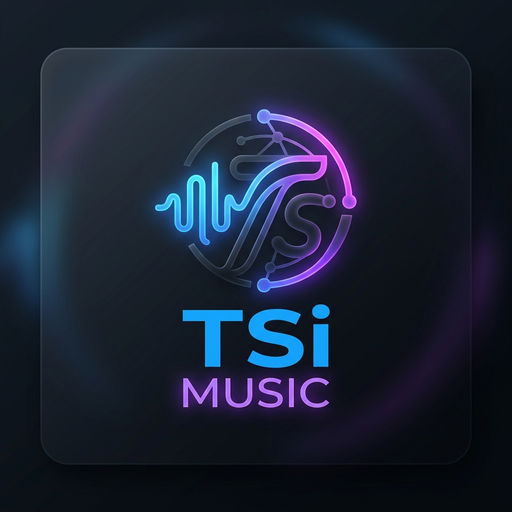

# TSi MUSIC

> Fork premium do [Music Assistant](https://github.com/music-assistant/frontend) — rebranding, tema glassmorphism, traduções pt_BR e 15+ funcionalidades de UX para o ecossistema **SaúdeClínica**.

{ width="128" }

---

## 🚀 Quick Start

```bash
# Clonar o repositório
git clone https://github.com/B0yZ4kr14/TSiMUSIC.git
cd TSiMUSIC

# Instalar dependências
yarn install

# Desenvolvimento local
yarn dev          # http://localhost:3000

# Lint e testes
yarn lint
yarn test:run

# Build de produção
yarn build        # Saída: music_assistant_frontend/
```

---

## 📋 Links Rápidos

| Documento | Descrição |
|-----------|-----------|
| [Arquitetura](architecture.md) | Diagramas e componentes do sistema |
| [Deploy](deploy.md) | Pipeline CI/CD, Docker e nginx |
| [API](api.md) | Endpoints e referência de WebSocket |
| [Certificados](cert.md) | SSL dual: Let's Encrypt + self-signed |
| [Troubleshooting](troubleshooting.md) | Problemas comuns e soluções |
| [Changelog](changelog.md) | Histórico de releases |

---

## ✨ Destaques

- 🎨 **Tema premium TSi MUSIC** — glassmorphism, gradiente roxo `#7c3aed`
- 🌙 **Dark mode** nativo com ajustes de contraste premium
- 🎛️ **Mini Player Mode** — toggle compacto/completo (tecla `M`)
- 🖥️ **Fullscreen player** com relógio, visualizador e controles estendidos
- ⌨️ **Atalhos de teclado globais** — espaço, setas, `F`, `M`, `Esc`, `/`, `?`
- 📲 **PWA Install Prompt** — card elegante com cooldown de 7 dias
- 🌊 **Audio Visualizer Canvas** — 64 barras animadas no fullscreen
- 🇧🇷 **Traduções pt_BR** — 1471/1532 chaves (96%)
- 🔒 **Security audit** — 10 HIGH → **0 vulnerabilidades**

---

## 🛠️ Stack Tecnológica

| Tecnologia | Versão |
|------------|--------|
| Vue.js | 3.x (Composition API) |
| TypeScript | Strict mode |
| Vite | Build tool |
| Vuetify + shadcn-vue | UI frameworks |
| Tailwind CSS v4 | Estilização |
| Vue I18n | Internacionalização |
| Vitest | Testes |

---

## 🌐 Produção

| Configuração | Valor |
|--------------|-------|
| Servidor | `saudeclinica` (Tailscale) |
| URL | `https://100.86.64.1:8443/` |
| Container | `ma-wiki` (nginx:alpine) |
| Portas | `8080:80`, `8443:443` |
| Login | `Admin` / `saude@clinica` |

---

> 🏷️ `#TSiMUSIC` `#MidiaServer-SaudeClinica`
